# System Architecture
## Nocturn AI — AI Inquiry Capture & Conversion Engine
### Version 1.2 · 13 Feb 2026
### Aligned with [product_context.md](./product_context.md) · Steered by [building-successful-saas-guide.md](./building-successful-saas-guide.md)

---

## 1. Architecture Philosophy

This system is designed around **four non-negotiable constraints** derived from 20 years of building production systems at scale:

1. **Guest latency < 30 seconds end-to-end.** Every architectural decision optimizes for this. A guest sends a WhatsApp message at 11pm and gets a useful answer before they switch to Booking.com.
2. **Multi-tenant isolation from Day 1.** Property A's data never leaks to Property B. This is a trust product — one leak and every hotel cancels.
3. **Operational simplicity over architectural elegance.** This is a 2-person engineering team shipping in 28 days. No microservices. No Kubernetes. One backend, one database, auto-scaling containers.
4. **Observability from the start.** You cannot fix what you cannot measure. OpenTelemetry + metrics + alerting from day one. Set up alerts at 70% capacity thresholds.

---

## 2. High-Level Architecture

```mermaid
graph TB
    subgraph "Guest Touchpoints"
        WA["📱 WhatsApp<br/><i>Meta Cloud API</i>"]
        WW["🖥️ Web Chat Widget<br/><i>Embeddable JS</i>"]
        EM["📧 Email<br/><i>SendGrid Inbound Parse</i>"]
    end

    subgraph "Edge / Ingress"
        GW["🔀 API Gateway<br/><i>Cloud Run + FastAPI</i><br/><i>Rate limiting · Auth · Routing</i>"]
    end

    subgraph "Core Application (Single Container)"
        CE["🧠 Conversation Engine<br/><i>Session management</i><br/><i>Context tracking</i><br/><i>Channel normalization</i>"]
        AI["🤖 AI Core<br/><i>LLM orchestration</i><br/><i>RAG pipeline</i><br/><i>Prompt management</i>"]
        LC["📋 Lead Capture<br/><i>Contact extraction</i><br/><i>Intent classification</i><br/><i>Value estimation</i>"]
        HH["👤 Human Handoff<br/><i>Escalation detection</i><br/><i>Context packaging</i><br/><i>Staff notification</i>"]
        AN["📊 Analytics Engine<br/><i>Daily aggregation</i><br/><i>Report generation</i>"]
    end

    subgraph "Data Layer"
        PG["🐘 PostgreSQL 16<br/><i>+ pgvector</i><br/><i>Conversations · Leads · Analytics</i>"]
        RD["⚡ Redis<br/><i>Session state</i><br/><i>Rate limiting</i><br/><i>Pub/Sub for handoff</i>"]
    end

    subgraph "External Services"
        META["Meta WhatsApp<br/>Cloud API"]
        LLM["OpenAI GPT-4o-mini"]
        SMTP["SendGrid<br/><i>Inbound Parse + Outbound</i>"]
    end

    subgraph "Staff Interface"
        DASH["📊 Staff Dashboard<br/><i>Next.js</i><br/><i>Live conversations</i><br/><i>Lead management</i><br/><i>GM analytics</i>"]
    end

    WA --> GW
    WW --> GW
    EM --> GW
    GW --> CE
    CE --> AI
    CE --> LC
    CE --> HH
    AI --> PG
    AI --> LLM
    LC --> PG
    HH --> RD
    AN --> PG
    AN --> SMTP
    CE --> RD
    DASH --> GW
    WA -.-> META

    style WA fill:#25D366,color:#fff
    style WW fill:#22c55e,color:#fff
    style EM fill:#3b82f6,color:#fff
    style CE fill:#f59e0b,color:#000
    style AI fill:#8b5cf6,color:#fff
    style AN fill:#ec4899,color:#fff
    style PG fill:#336791,color:#fff
    style RD fill:#DC382D,color:#fff
    style DASH fill:#0ea5e9,color:#fff
```



---

## 3. Design Decisions & Rationale

### 3.1 Monolith-First (Single Backend Container)

| Option Considered | Decision | Why |
|---|---|---|
| Microservices (separate conversation, AI, analytics services) | **Rejected** | 2-person team. 28-day deadline. Network overhead between services adds latency. Debugging distributed systems is a time sink. |
| Modular monolith (single FastAPI app, clean module boundaries) | **Chosen** | One deployment unit. Sub-millisecond inter-module calls. Can be split later if scale demands it (it won't for 100 properties). |

> At Google, we called this "monolith until it hurts." At 100 properties × 2,000 conversations/month, a single well-tuned container handles this easily. A Cloud Run instance with 2 vCPU and 4GB RAM can process ~50 concurrent conversations.

### 3.2 PostgreSQL + pgvector (No Separate Vector DB)

| Option Considered | Decision | Why |
|---|---|---|
| Pinecone / Qdrant (dedicated vector DB) | **Rejected for v1** | Extra service to manage. Extra cost. Sub-100ms latency is achievable with pgvector for our scale (<50k vectors per property). |
| PostgreSQL 16 + pgvector extension | **Chosen** | Single database for relational AND vector data. Simplifies ops. HNSW indexes give ~10ms retrieval. Transactional consistency between KB lookups and conversation writes. |

### 3.3 Redis for Session State (Not Database Sessions)

Conversations are multi-turn. The AI needs the last 5–10 messages as context for every response. Storing session state in Redis (not PostgreSQL) means:
- **Read latency**: ~1ms (Redis) vs ~5–10ms (PostgreSQL)
- **Write-behind**: Session updates are written to PostgreSQL asynchronously for persistence. Redis is the hot path.
- **TTL-based expiry**: Inactive sessions auto-expire after 30 minutes. No cleanup jobs.

### 3.4 Channel Normalization Pattern

All three channels (WhatsApp, Web, Email) produce different message formats. The Conversation Engine normalizes them into a single internal message format before processing:

```
┌─────────────┐     ┌──────────────────┐     ┌────────────────┐
│  WhatsApp    │────>│                  │     │                │
│  Webhook     │     │  Channel         │     │  Conversation  │
├─────────────┤     │  Normalizer      │────>│  Engine        │
│  Web Widget  │────>│                  │     │                │
│  WebSocket   │     │  Produces:       │     │  Sees:         │
├─────────────┤     │  NormalizedMsg {  │     │  One unified   │
│  Email       │────>│    channel       │     │  message type  │
│  Parse Hook  │     │    sender_id     │     │                │
└─────────────┘     │    content       │     └────────────────┘
                    │    metadata      │
                    │  }               │
                    └──────────────────┘
```

This is critical. The AI engine should never know or care what channel a message came from. Channel-specific behavior (e.g., WhatsApp message length limits, email threading) is handled at the edges.

### 3.5 Technical Debt Strategy

> *"Some debt is fine. But if every change risks breaking something, you've crossed the line. Plan for refactoring sprints."*

| Practice | Commitment |
|----------|------------|
| **Document shortcuts** | TODO comments with business threshold: `# TODO: Move to config when >50 customers` |
| **Refactoring cadence** | One refactoring sprint every 4–5 feature sprints |
| **Hardcoding v1** | Acceptable if it validates the business model faster. Track and schedule cleanup. |
| **Critical path testing** | Signup-to-payment flow: comprehensive automated tests. Everything involving money. |

**Rule:** Technical perfectionism kills. Ship in 28 days. Iterate based on customer feedback.

### 3.6 API Design — External-First

Design the API as if external customers will use it from day one. This forces good architectural decisions.

- **Versioning:** `/api/v1` from day one. Never break v1; introduce v2 when needed.
- **Resource modeling:** RESTful with clear resource boundaries. Version in URL, not header.
- **Documentation:** OpenAPI/Swagger auto-generated from code. B2B: poor docs = churn.

---

## 4. Technology Stack

| Layer | Technology | Justification |
|---|---|---|
| **Backend API** | Python 3.12 + FastAPI | Async-native. LLM ecosystem is Python-first. Team already building in it (Sprint 1 complete). |
| **Database** | PostgreSQL 16 + pgvector | Battle-tested. Vector search built-in. Handles relational + vector in one engine. |
| **Cache / Sessions** | Redis 7 (Cloud Memorystore) | Sub-millisecond session reads. Pub/Sub for real-time handoff notifications. |
| **LLM** | OpenAI GPT-4o-mini (primary) | ~$0.15/1M input tokens. Best cost/quality for conversational AI at this scale. |
| **LLM Fallback** | Anthropic Claude Haiku | If OpenAI is down or rate-limited. Same prompt templates, different provider. |
| **Web Widget** | Vanilla JS + CSS (embeddable) | Zero dependencies for hotel. Single `<script>` tag. <50KB bundle. |
| **Staff Dashboard** | Next.js 14 (React) | SSR for performance. App Router for clean routing. Team has experience. |
| **Authentication** | JWT (v1) → Auth0/Clerk (production hardening) | *Don't build auth yourself.* Current JWT acceptable for MVP. Migrate to Auth0 or Clerk before SOC 2 or 50+ customers. Security breaches kill young SaaS. |
| **Observability** | OpenTelemetry + DataDog/New Relic (or GCP Cloud Trace) | Structured metrics, latency percentiles, error tracking. Alerts at 70% DB/API capacity. Implement in Sprint 1–2. |
| **Product Analytics** | Amplitude or Mixpanel | Every feature instrumented for usage. Implement in month one. A/B testing infrastructure before needed. |
| **WhatsApp** | Meta WhatsApp Business Cloud API | Official API. No third-party dependency. Webhook-based. |
| **Email** | SendGrid (Inbound Parse + Outbound) | Webhook for inbound. SMTP for outbound. **Requires:** SPF, DKIM, DMARC for deliverability. |
| **Payments** | Stripe (when added) | Don't build payment processing. Implement dunning (failed payment retry) — recovers 20–30% of failed transactions. |
| **Infrastructure** | Google Cloud Run | Auto-scaling containers. Pay-per-use. No cluster management. Already deployed. |
| **CI/CD** | GitHub Actions | Standard. Fast. Integrated with Cloud Run deployment. |

---

## 5. Data Architecture

### 5.1 Entity Relationship Model


### 5.2 Multi-Tenant Data Isolation

Every query includes `property_id` as a mandatory filter. Implemented via:

1. **Row-Level Security (RLS)** on PostgreSQL — enforced at the database level, not just application level.
2. **API middleware** that extracts `property_id` from the authenticated session and injects it into every query.
3. **Knowledge base embeddings** are partitioned by `property_id` in the vector index. A RAG search for Property A never returns Property B's content.

### 5.3 Session State (Redis Schema)

```
# Active conversation session
conv:{conversation_id} → {
    property_id: uuid,
    channel: "whatsapp|web|email",
    guest_id: string,
    messages: [last 10 messages],  # Context window for LLM
    ai_mode: "concierge|lead_capture|handoff",
    lead_data: {partial lead info collected so far},
    last_activity: timestamp,
    ttl: 1800  # 30 min expiry
}

# Handoff notification channel
handoff:{property_id} → Pub/Sub channel for real-time staff alerts
```

---

## 6. Core Processing Flows

### 6.1 Guest Message Flow (All Channels)


**Target end-to-end latency budget:**

| Step | Budget | Notes |
|---|---|---|
| Channel → API Gateway | 50ms | Network latency |
| Rate limit + Auth | 10ms | Redis lookup |
| Session retrieval (Redis) | 5ms | In-memory |
| KB semantic search (pgvector) | 30ms | HNSW index |
| LLM API call (GPT-4o-mini) | 800–2000ms | **Dominant cost.** Streaming reduces perceived latency. |
| Persistence (async) | 0ms on hot path | Written after response is sent |
| Response formatting + send | 50ms | Channel API call |
| **Total** | **~1–2.5 seconds** | Well within 30s target |

### 6.2 Human Handoff Flow

```mermaid
sequenceDiagram
    participant G as Guest
    participant AI as AI Core
    participant CE as Conversation Engine
    participant RD as Redis Pub/Sub
    participant DASH as Staff Dashboard
    participant S as Staff Member

    G->>AI: "I need to speak to someone"
    AI->>AI: Detect handoff intent<br/>confidence < threshold OR explicit request
    AI->>CE: Handoff signal + context summary
    CE->>CE: Package context:<br/>• Guest name/phone<br/>• Conversation summary<br/>• Intent classification<br/>• Channel
    CE->>RD: Publish to handoff:{property_id}
    RD-->>DASH: Real-time notification
    AI-->>G: "I'm connecting you with our team.<br/>They'll have the full context of our conversation."
    
    Note over DASH: Staff sees notification<br/>with full context
    S->>DASH: Click "Take Over"
    DASH->>CE: POST /conversations/:id/takeover
    CE->>CE: Set ai_mode = "staff"<br/>Route messages to staff
    S-->>G: "Hi! I'm [Name] from reservations.<br/>I can see you're looking for..."
```



### 6.3 After-Hours Detection

```python
# Simplified operating hours check
def is_after_hours(property: Property, timestamp: datetime) -> bool:
    local_time = timestamp.astimezone(property.timezone)
    day_schedule = property.operating_hours.get(local_time.strftime('%A').lower())
    if not day_schedule:
        return True  # No schedule = closed
    return not (day_schedule['open'] <= local_time.time() <= day_schedule['close'])
```

When `is_after_hours == True`:
- Conversation is flagged `is_after_hours = True`
- AI appends: *"Our reservations team will follow up first thing tomorrow morning."*
- Lead is created with `priority = high`
- Lead appears in the "After-Hours Recovery" section of the dashboard

---

## 7. AI / RAG Architecture

### 7.1 Knowledge Base Ingestion Pipeline
> **Note:** To support "Live in 48 Hours" (website promise), this pipeline must support rapid ingestion. SheersSoft team builds the KB from property info (rate card, FAQs) shared on Day 0. Supports bulk ingestion from raw formats (PDF, Docx, CSV) via admin CLI or scripts, converting to structured Markdown/JSON.

```
Property KB Document (Markdown/JSON)
    │
    ▼
┌───────────────────┐
│  Chunker          │  Split into ~500-token chunks
│  (recursive text) │  Overlap: 50 tokens
└───────┬───────────┘
        │
        ▼
┌───────────────────┐
│  Embedder         │  OpenAI text-embedding-3-small
│  (1536 dims)      │  Batch processing
└───────┬───────────┘
        │
        ▼
┌───────────────────┐
│  PostgreSQL       │  INSERT into knowledge_items
│  + pgvector       │  HNSW index per property
└───────────────────┘
```

### 7.2 RAG Retrieval Strategy

1. **Embed** the guest's question using the same embedding model.
2. **Vector search** against `knowledge_items` WHERE `property_id = :pid` ORDER BY cosine similarity, LIMIT 5.
3. **Relevance filter**: only include items with similarity > 0.7.
4. **Inject** retrieved items into the LLM prompt as structured context.

### 7.3 Prompt Architecture

```
┌─────────────────────────────────────────────────┐
│ SYSTEM PROMPT                                    │
│ "You are a concierge for {property_name}..."    │
│ Bilingual: English + Bahasa Malaysia (auto-detect) │
│ Behavioral rules, guardrails, response format    │
├─────────────────────────────────────────────────┤
│ PROPERTY CONTEXT (from RAG)                      │
│ Retrieved KB items: rates, rooms, facilities     │
├─────────────────────────────────────────────────┤
│ CONVERSATION HISTORY (from Redis)                │
│ Last 10 messages for multi-turn context          │
├─────────────────────────────────────────────────┤
│ CURRENT MESSAGE                                  │
│ Guest's latest message                           │
└─────────────────────────────────────────────────┘
```

**Three AI Modes via System Prompt Variants:**

| Mode | Trigger | Prompt Behavior |
|---|---|---|
| **Concierge** | Default | Friendly, informative. Answers questions. Offers help. |
| **Lead Capture** | Booking intent detected (dates, "available?", "how much?") | Collect: name, dates, room preference, contact. Warm, not pushy. |
| **Handoff** | Guest requests human / complaint / complex request | Acknowledge, assure, prepare context summary for staff. |

---

## 8. API Design

### 8.1 Endpoint Specification

```
# ─── Channel Webhooks ───────────────────────────────
POST   /api/v1/webhook/whatsapp                 # Meta WhatsApp Cloud API webhook
GET    /api/v1/webhook/whatsapp                  # Webhook verification (GET challenge)
POST   /api/v1/webhook/email                     # SendGrid Inbound Parse

# ─── Web Widget Conversations ──────────────────────
POST   /api/v1/conversations                     # Start new web conversation
POST   /api/v1/conversations/{id}/messages       # Guest sends message
GET    /api/v1/conversations/{id}                # Get conversation + messages

# ─── Human Handoff ─────────────────────────────────
POST   /api/v1/conversations/{id}/handoff        # AI triggers handoff
POST   /api/v1/conversations/{id}/takeover       # Staff takes over
POST   /api/v1/conversations/{id}/resolve        # Staff resolves conversation

# ─── Lead Management ──────────────────────────────
GET    /api/v1/properties/{id}/leads             # List leads (filterable)
GET    /api/v1/leads/{id}                        # Lead detail
PATCH  /api/v1/leads/{id}                        # Update lead status/notes

# ─── Property Administration ──────────────────────
POST   /api/v1/properties                        # Onboard new property
GET    /api/v1/properties/{id}/settings          # Get property config
PUT    /api/v1/properties/{id}/knowledge-base    # Upload/update KB
POST   /api/v1/properties/{id}/onboard           # Self-serve onboarding flow

# ─── Analytics & Reports ──────────────────────────
GET    /api/v1/properties/{id}/analytics         # Dashboard data (date range)
GET    /api/v1/properties/{id}/analytics/summary # Key metrics for GM view
GET    /api/v1/properties/{id}/reports           # Generated reports list

# ─── Health ───────────────────────────────────────
GET    /api/v1/health                            # Liveness + dependency check
```

### 8.2 Authentication Model

| Context | Auth Method |
|---|---|
| **WhatsApp webhook** | Meta webhook signature verification (X-Hub-Signature-256) |
| **Web widget** | Property API key (embedded in widget config). Rate-limited per key. |
| **Email webhook** | SendGrid IP allowlist + Basic Auth on webhook URL |
| **Staff dashboard** | JWT (access + refresh tokens). Property-scoped. |
| **Admin API** | JWT with admin role. Super-tenant access for onboarding. |

---

## 9. Infrastructure & Deployment

### 9.1 Cloud Architecture

```
Google Cloud Platform
├── Cloud Run (Backend API)
│   ├── Auto-scales 0 → N instances
│   ├── 2 vCPU, 4GB RAM per instance
│   ├── Min instances: 1 (avoid cold starts for latency SLA)
│   └── Max instances: 10 (sufficient for 100 properties)
│
├── Cloud Run (Staff Dashboard — Next.js)
│   ├── Auto-scales 0 → N
│   └── Serves SSR dashboard pages
│
├── Cloud SQL (PostgreSQL 16 + pgvector)
│   ├── db-custom-2-8192 (2 vCPU, 8GB RAM)
│   ├── 100GB SSD
│   ├── Automated backups (daily)
│   └── High availability for production
│
├── Cloud Memorystore (Redis 7)
│   ├── 1GB instance (Basic tier)
│   └── Session state + pub/sub
│
└── Cloud CDN / Cloud Storage
    └── Widget JS bundle (static hosting)
```

### 9.2 Deployment Pipeline


---

## 10. Security & Compliance

### 10.1 PDPA Compliance Checklist

| Requirement | Implementation |
|---|---|
| Consent for data collection | Widget shows privacy notice before first message. WhatsApp: business profile links to privacy policy. |
| Data encryption at rest | PostgreSQL: TDE (Transparent Data Encryption) on Cloud SQL. |
| Data encryption in transit | TLS 1.3 on all endpoints. Cloud Run enforces HTTPS. |
| Data isolation | Row-Level Security per property. Separate vector indexes. |
| Right to deletion | API endpoint to purge guest data by phone/email + cascade. |
| Data retention | Configurable per property. Default: 90 days for conversations, 365 days for leads. Auto-purge job. |
| Audit trail | All data access logged. Admin actions tracked. |

### 10.2 Security Measures

- **Rate limiting**: SlowAPI middleware. 100 req/min per widget API key. 500 req/min per WhatsApp webhook.
- **Input sanitization**: All guest messages sanitized before LLM prompt injection (strip special tokens, limit length).
- **PII handling**: Guest phone/email encrypted at field level using Fernet symmetric encryption. Decrypted only at display time.
- **API key rotation**: Property API keys can be rotated without downtime.

### 10.3 Backup & Disaster Recovery

| Requirement | Implementation |
|-------------|----------------|
| Automated backups | Cloud SQL: daily automated backups with point-in-time recovery |
| Restore testing | Quarterly test restores. *Companies lose everything because they had backups but never tested them.* |
| Runbooks | Document as encountered: provision new customer, handle payment failure, investigate production issue |

### 10.4 Observability Implementation

| Component | Implementation |
|-----------|----------------|
| **Structured logging** | Structlog with correlation IDs. Log level, tenant, latency per request. |
| **Metrics** | Request latency (P50, P95, P99), error rate, conversation volume, LLM token usage. |
| **Alerting** | 70% DB CPU, API error rate >1%, latency P95 >5s. Alert on-call, not just log. |
| **Tracing** | OpenTelemetry for request flow: webhook → conversation engine → LLM → response. |

---

## 11. Scalability Considerations

### Current Design Supports

| Metric | Capacity | Bottleneck |
|---|---|---|
| Concurrent conversations | 500+ | LLM API rate limits (GPT-4o-mini: 10,000 RPM) |
| Properties | 100+ | PostgreSQL handles it easily |
| Messages per day | 50,000+ | Cloud Run auto-scaling |
| KB items per property | 10,000+ | pgvector HNSW handles millions |

### When to Scale Beyond v1

| Signal | Action |
|---|---|
| LLM latency > 3s consistently | Add Claude Haiku as parallel provider. Load balance across providers. |
| Database CPU > 70% sustained | Scale up Cloud SQL. Add read replicas. |
| Redis memory > 80% | Scale up Memorystore. Or move cold sessions to PostgreSQL. |
| > 500 concurrent conversations | Consider splitting conversation engine into a dedicated service. This is the first microservice extraction. |

---

*This architecture is intentionally simple. The hardest engineering challenge in this product is not scale — it's AI quality. Every hour spent on infrastructure complexity at this stage is an hour not spent on making the AI responses accurate, the handoff seamless, and the dashboard compelling. Ship the monolith, tune the AI, and earn the right to add complexity. Context validated against [product_context.md](./product_context.md).*
