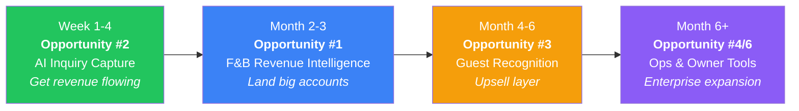

# Hospitality Market Gap Analysis
### Based on 8 Industry Interviews & Blueprint Research · Feb 2026

---

## Executive Summary

After analyzing interviews with **7 hospitality professionals** spanning GMs, Revenue Managers, consultants, and reservation managers across Malaysia, Singapore, Japan, and Qatar — a clear picture emerges. The hospitality industry is **data-rich in rooms, data-blind everywhere else**, and operationally held together by WhatsApp, Excel, and tribal knowledge.

This document identifies **6 scored opportunities**, each with conviction rationale, caveats, and a recommendation on whether to engage. The scoring framework weighs: **Pain Intensity** (how much it hurts), **Willingness to Pay** (can you get a check?), **Time to Value** (how fast can you prove ROI?), and **Market Size** (how many doors can you knock on?).

---

## The 5 Structural Truths From The Interviews

Before the opportunities, understand the **ground truth** that emerged consistently across all interviews:

| # | Structural Truth | Who Said It | Implication |
|---|---|---|---|
| 1 | **"F&B has zero data infrastructure"** — rooms have Opera, IDS, TravelClick. F&B has nothing. | Amsyar (IHG Doha), Floyd, Bob | Massive unserved whitespace |
| 2 | **"90% of bookings come through manual channels"** — walk-ins, WhatsApp, phone, email. | Zul (Vivatel), Shamsuridah (Novotel KLCC) | Inquiry leakage is structural, not accidental |
| 3 | **"IT is the silent killer, not finance"** — finance wants efficiency; IT fears change cycles. | Bob (GM), Shafar (ANA Crowne Plaza) | Sell to GM/Revenue, not IT |
| 4 | **"Hotels buy on ROI speed, not ROI size"** — owners want fast payback, not big promises. | Shafar, Bob, Floyd | Pilot must show value in <30 days |
| 5 | **"Guests don't complain. They just don't come back."** — silent churn is the #1 revenue killer. | Floyd, Floyd Blueprint, Shafar | Retention tools > acquisition tools |

---

## Opportunity Scoring Framework

Each opportunity is scored on 4 axes (1-10 scale):

| Axis | What It Measures |
|---|---|
| 🔥 **Pain Intensity** | How badly does the market bleed from this problem today? |
| 💰 **Willingness to Pay** | Are there budgets, procurement cycles, and decision-makers aligned? |
| ⚡ **Time to Value** | Can you demonstrate ROI in a pilot within 2-4 weeks? |
| 🌍 **Market Size** | How many properties globally have this exact problem? |

**Score = Average of 4 axes. Max = 10.**

---

## Opportunity 1: F&B Revenue Intelligence Platform
### *"The $0 Data Layer That Runs a $Billions Vertical"*

> **Score: 8.5 / 10** — 🏆 **TOP PICK**

| Axis | Score | Rationale |
|---|---|---|
| 🔥 Pain | **9** | Amsyar: *"No KYC for F&B, no demand forecasting, Avero is terrible."* Floyd: *"Opera already cover front office, zero for F&B."* Bob: *"F&B change menu every 3 months. Data is gone. Cannot compare."* |
| 💰 WTP | **8** | Amsyar: *"Hotels will buy you"* if you can optimize RevPASH. Hilton KL already has a dedicated F&B Revenue Manager. Big chains are actively looking. |
| ⚡ TTV | **8** | Can demonstrate menu engineering insights and RevPASH/RevPSM dashboards within 2-3 weeks by connecting to Micros POS export data. |
| 🌍 Size | **9** | Every hotel with 2+ outlets globally. City hotels with ballrooms (Hilton KL: 10 outlets) are the ideal ICP. |

**What to build:**
- RevPASH (Revenue Per Available Seat Hour) tracking per outlet
- RevPSM (Revenue Per Square Meter) for meeting/banquet spaces
- Menu engineering analytics (what sells, what expires, what to bundle)
- Banquet space yield optimization (which booking to prioritize: wedding vs. 5-day corporate)
- Demand forecasting for F&B (the "MyLighthouse for outlets")

**Why YES:**
- Amsyar literally said *"my advice is jangan focus pada bilik — dah banyak orang buat. Nothing for F&B."* This is a Revenue Manager at InterContinental telling you where the whitespace is.
- Rooms are 70% profitability, F&B is 35% — but F&B has **zero tooling to improve that 35%**. Even a 5% margin improvement at scale is enormous.
- Hotels already have the raw data in Micros POS — nobody is turning it into decisions.
- Hilton KL already has weekly F&B rev meetings — they're doing this manually. You automate it.

**Why NOT / Caveats:**
- Micros/POS integration requires Oracle cooperation. Shafar warned: *"Opera asked $25k just for backend keys."* You may need to start with CSV exports.
- F&B outlet managers are operators, not analysts — UX must be dead simple (Amsyar: *"I'm good with graphs, not numbers"*).
- Requires proving the concept at a property with multiple outlets first (Hilton KL or similar).

> [!IMPORTANT]
> Amsyar (your insider) is leaving IHG Doha on 12 Feb 2026 and joining Accor Resort Doha. **This is a 48-hour window to lock him in as an advisor/champion before he transitions.**

---

## Opportunity 2: AI-Powered Inquiry Capture & Conversion Engine
### *"The After-Hours Revenue Recovery Machine"*

> **Score: 7.8 / 10**

| Axis | Score | Rationale |
|---|---|---|
| 🔥 Pain | **8** | Zul: *"After office hours, reservations are closed. Inquiries are dropped."* Shamsuridah: *"200-300 emails+calls on busy days. 30% need manual intervention."* |
| 💰 WTP | **7** | Bernard: *"99% of hotels, the main pain is paying the OTA. If I could switch 1% acquisition from OTA to website → RM3,000 saving/month."* GMs understand this math. |
| ⚡ TTV | **9** | Can deploy an AI responder on WhatsApp/web within days. Pilot ROI visible in week 1 from captured after-hours leads. |
| 🌍 Size | **7** | Strongest for independent and mid-tier brands (3-4 star). Big chains are building internally. |

**What to build:**
- AI chatbot/concierge for WhatsApp, website, and email that handles inquiries 24/7
- Lead capture + CRM-lite (track inquiry → booking conversion)
- Auto-response with rate quotes, room availability, and F&B info
- "After-hours recovery" dashboard showing inquiries that would have been dropped

**Why YES:**
- Zul's Vivatel: Only 10% direct bookings, 90% manual. 3 staff + 1 dedicated "catch-all" person. After 6pm = zero coverage. This is **money falling on the floor every night.**
- Shamsuridah's Novotel KLCC: 100 emails/day, 30% manual. Extra hour on busy days. Clear labor arbitrage.
- Bernard validated: *"Hotels don't care about leakage recovery as a concept — they care about money generation and operating efficiency."* Frame it as revenue, not cost savings.
- Fastest to pilot. You can show captured leads in 7 days.

**Why NOT / Caveats:**
- Bernard also said: *"Not priority"* when asked if GMs will pay to solve inquiry leakage. Must be framed as **OTA displacement** (saving 15-25% commission), not "answered more emails."
- Crowded space. Many AI chatbot vendors already exist (Bernard: *"Join ITP Asia, a lot more AI chatbot"*). Differentiation is key.
- Accor is actively eliminating phone calls for 100% system bookings (Shamsuridah). Large chains may build this in-house.
- Data privacy concerns — Jeff from Capri by Fraser explicitly cited *"data breach concern"* as reason to avoid new tools.

> [!TIP]
> The killer pitch is NOT "we answer your messages." It's: **"For every 100 inquiries you get, 30 come after 6pm. Today you lose all 30. We recover 20 of them. At your ADR of RM230, that's RM4,600/night you're leaving on the table."**

---

## Opportunity 3: Guest Recognition & Retention Intelligence (KYC Engine)
### *"The Birthday Cake That Nobody Ordered"*

> **Score: 7.3 / 10**

| Axis | Score | Rationale |
|---|---|---|
| 🔥 Pain | **8** | Floyd: *"None of them send me Happy Birthday. LHDN is more effective."* Shafar: *"$8-10k/month lost from one guest who wasn't recognized."* Blueprint: *"15% business lost to brand damage."* |
| 💰 WTP | **7** | Bernard: *"60% of hoteliers don't mind being bombarded with related promos."* Personalization sells. But budget allocation is unclear. |
| ⚡ TTV | **6** | Requires historical guest data integration with PMS. Not a 1-week pilot. |
| 🌍 Size | **8** | Universal problem. Every hotel worldwide loses repeat guests to silence. |

**What to build:**
- Cross-stay guest profile that persists across visits (preferences, complaints, spending patterns)
- Automated trigger system: birthdays, anniversaries, loyalty milestones
- Pre-arrival briefing for front desk staff: *"Mr. Malik arrives today. Prefers corner room. Traveling with family of 4. Had a complaint about AC at Sydney property."*
- Retention scoring: predict which guests are at risk of churning

**Why YES:**
- Floyd's birthday story is devastating. He's a connected industry insider and not ONE hotel has wished him happy birthday. **LHDN (the tax office) does it better.** This is embarrassing for the industry.
- Shafar's Sydney→Kobe story: one guest's bad experience at another property carried over, nobody flagged it, and they lost $8-10k/month. Cross-property intelligence is worth its weight in gold.
- Blueprint response: *"Hospitality repeated business constitutes to almost 40% of total revenues."* Protecting 40% of revenue with a retention tool is easy math.
- Bernard's survey: 60% of guests are okay with personalized outreach. The demand side wants this.

**Why NOT / Caveats:**
- PMS integration is the gatekeeper. Opera's walled garden means $25k+ just for API access (Shafar's warning).
- PDPA/data privacy is a real blocker. Shafar: *"One name leaked = $1M penalty for US-registered companies."* Malaysia's PDPA is getting stricter.
- Floyd's blueprint response was skeptical: *"Unless you know the person personally, nobody cares these days."* Some industry veterans are jaded about CRM.
- Long time-to-value. You can't prove retention ROI in a 2-week pilot — it takes months to measure repeat bookings.

> [!WARNING]
> This is a **high-value, slow-burn** opportunity. Don't lead with this for your MVP. Layer it on top of Opportunity 1 or 2 after you've established trust with the property.

---

## Opportunity 4: AI-Assisted Staff Operations & SOP Compliance
### *"The Manager That Never Sleeps"*

> **Score: 6.8 / 10**

| Axis | Score | Rationale |
|---|---|---|
| 🔥 Pain | **8** | Floyd: *"Who monitors staff? Manager too busy."* Blueprint: audit scored 38% against 75% passing. Retraining cost up 27% of monthly revenue. |
| 💰 WTP | **6** | Training budgets exist but are often the first to be cut. Owners think *"anyone can be hired from the streets."* |
| ⚡ TTV | **6** | Requires SOP digitization and workflow setup per property. Not plug-and-play. |
| 🌍 Size | **7** | Manpower shortage is global (Malaysia, Indonesia, Japan all cited). |

**What to build:**
- Digital SOP checklists with AI-powered task verification
- Staff training chatbot (Floyd's vision: *"Ask question to AI, AI addresses the problem"*)
- Shift monitoring and task completion dashboards
- Escalation routing: housekeeping complaint → FO → compensation workflow

**Why YES:**
- The audit story from the blueprint is devastating: a property scored **38% on brand audit** because the trained managers left and SOPs weren't retrained. Re-hiring + retraining cost 27% of monthly revenue for 3-6 months.
- Shafar: manpower shortage is structural across MY, ID, JP. Hotels are forced to hire unskilled foreign labor and train on the job. AI-assisted training reduces the ramp-up time.
- Floyd's vision aligns perfectly: *"Nobody wants to sit in classroom 4 hours. Want everything at a click of a button."*

**Why NOT / Caveats:**
- Hard to monetize directly. GMs see this as "nice to have," not "must have." The ROI argument is indirect (fewer audit failures, less retraining cost).
- Requires deep customization per brand's SOP framework. Not scalable as a horizontal product without significant templating work.
- Competes with brand-level training platforms (IHG, Marriott, Accor all have internal learning systems).
- Blueprint warned: owners view human resources as "variable cost" to be cut, not invested in.

---

## Opportunity 5: OTA Displacement & Direct Booking Optimizer
### *"Stop Paying 25% Tax to Booking.com"*

> **Score: 6.5 / 10**

| Axis | Score | Rationale |
|---|---|---|
| 🔥 Pain | **8** | Bernard: *"99% of hotels, main pain is paying the OTA."* Shamsuridah: rate leakage (RM300 internal vs RM150 on Agoda). |
| 💰 WTP | **6** | Pain is universal but solutions already exist (TravelClick, SiteMinder). Differentiation is hard. |
| ⚡ TTV | **6** | Requires booking engine integration, rate parity monitoring. Not a weekend build. |
| 🌍 Size | **6** | Huge market but extremely competitive. Bernard himself works at TravelClick/Amadeus doing exactly this. |

**What to build:**
- Rate parity monitoring (detect when OTAs undercut your direct rate)
- GEO (Generative Engine Optimization) — make your property the answer when AI search tools recommend hotels
- Direct booking conversion tools (better website booking flow, WhatsApp-to-booking)
- BRG (Best Rate Guarantee) automation

**Why YES:**
- The math is simple: 15-25% OTA commission on every booking. Move even 5% of bookings direct = significant savings.
- Bernard's GEO insight is ahead of the curve: *"Now people use AI — don't even go to OTA. GEO — mainly for AI, generative engine optimization."* This is the next wave.
- Shamsuridah's rate leakage example (RM300 vs RM150 on Agoda) shows the BRG process is still manual and reactive.

**Why NOT / Caveats:**
- **Red ocean.** TravelClick, SiteMinder, Cloudbeds, and dozens of others already play here. Bernard literally works at the incumbant. You'd be fighting Amadeus.
- Large chains (Accor, Marriott, IHG) handle this centrally. You'd only sell to independents.
- Jeff at Capri by Fraser said: *"Hotel hardly receives calls or emails. Only corporate bookings."* Some properties simply don't have this problem at scale.

> [!CAUTION]
> This space is a **bloodbath of well-funded competitors**. Unless you have a genuinely novel angle (GEO is interesting), avoid leading with this. It's a feature, not a product.

---

## Opportunity 6: Owner Transparency & Revenue Assurance Dashboard
### *"The Anti-Theft Layer"*

> **Score: 6.0 / 10**

| Axis | Score | Rationale |
|---|---|---|
| 🔥 Pain | **9** | Floyd: *"Employee QR instead of company QR. Money enters personal account."* Zouk example: RM350k/night, 2% to staff pockets = untrackable. |
| 💰 WTP | **6** | Owners absolutely want this, but they're also the hardest to sell to (trust barrier). |
| ⚡ TTV | **4** | Requires POS integration, payment reconciliation, real-time audit trails. Complex build. |
| 🌍 Size | **5** | Strongest for owner-operators and independent chains. Big brands have internal controls. |

**What to build:**
- Real-time payment reconciliation (company QR vs. personal QR detection)
- F&B inventory audit trailing (goods-in vs. goods-sold discrepancy)
- Owner dashboard with real-time revenue visibility
- Anomaly detection for cash handling and stock discrepancies

**Why YES:**
- Floyd's stories are jaw-dropping. Staff using personal QR codes instead of company ones to intercept payments. Unaudited stock at Zouk. This is **real theft** happening at scale.
- Owners are paranoid about this (Floyd: *"Customer check-in room, money not entering bank."*). If you can prove you catch leakage, the ROI is instant and emotional.

**Why NOT / Caveats:**
- Politically dangerous. You're essentially building a surveillance tool. Staff and managers will resist adoption.
- Floyd himself warned: *"Hentam staff, semua orang tak datang kerja sudah."* Cracking down too hard causes mass walkouts.
- Complex integrations across POS, PMS, and payment gateways. Long build time.
- Trust barrier: owners need to trust YOUR system before giving you access to their financial data.

---

## Comparative Scorecard

| # | Opportunity | 🔥 Pain | 💰 WTP | ⚡ TTV | 🌍 Size | **Score** | Verdict |
|---|---|---|---|---|---|---|---|
| **1** | **F&B Revenue Intelligence** | 9 | 8 | 8 | 9 | **8.5** | 🟢 **BUILD THIS FIRST** |
| **2** | **AI Inquiry Capture Engine** | 8 | 7 | 9 | 7 | **7.8** | 🟢 **Fast pilot, quick cash** |
| **3** | **Guest Recognition/KYC** | 8 | 7 | 6 | 8 | **7.3** | 🟡 **Layer on after trust** |
| **4** | **AI Staff Ops & SOP** | 8 | 6 | 6 | 7 | **6.8** | 🟡 **Compelling but hard to sell** |
| **5** | **OTA Displacement** | 8 | 6 | 6 | 6 | **6.5** | 🔴 **Red ocean — avoid leading** |
| **6** | **Owner Revenue Assurance** | 9 | 6 | 4 | 5 | **6.0** | 🟡 **Niche but explosive if landed** |

---

## The Recommended Play: A Sequenced Strategy

### Why this sequence:

1. **Start with #2 (AI Inquiry Capture)** because it has the fastest time-to-value. You can deploy a WhatsApp/web AI responder in days, show recovered leads in week 1, and charge RM1,500-3,000/month. This gives you **cash flow, case studies, and credibility** while building the bigger play. Target: Vivatel (Zul already agreed to pilot), independents from the CRM list.

2. **Pivot to #1 (F&B Revenue Intelligence)** once you have 3-5 properties running the inquiry engine. This is the **big-money product** that solves a problem nobody else is solving. Target: Hilton KL (has F&B RevMgr), city hotels with 5+ outlets. Amsyar is your built-in advisor if you lock him down by Feb 12.

3. **Layer #3 (Guest Recognition)** as an upsell to properties already on your platform. By this point you have guest inquiry data (from #2) and F&B spend data (from #1) — you can build cross-channel guest profiles as a natural extension.

4. **#4 and #6 become enterprise modules** for larger deals, sold as add-ons or as part of a premium tier.

---

## The Procurement Playbook (How They Buy)

From the interviews, here's the **repeatable buying process** you'll encounter:

| Stage | Timeline | What Happens | Who to Target |
|---|---|---|---|
| **Discovery** | Week 1-2 | GM/Revenue Mgr identifies pain | Revenue Manager or GM (NOT IT) |
| **Internal Champion** | Week 2-4 | Champion builds internal case | Revenue Mgr presents to GM |
| **Comparison** | Month 1-2 | 3-5 vendor quotes collected | They WILL shop around (Bob warned you) |
| **Finance Gate** | Month 2-3 | Finance director debates cost | Shafar: *"Finance always debates even if cheap"* |
| **Owner Approval** | Month 3-6 | Owner evaluates ROI speed | Must show fast payback, not big promises |
| **Contract** | Month 3-6 | Avg 3-6 months from first contact | Bob: *"Something in the market = 3 months"* |

> [!IMPORTANT]
> **Critical Budget Cycle Intel:** Blueprint confirms hotels start budget prep in **July**, first draft by **October**, owner presentations in **Q4**. If you want to be in next year's budget, you need to be in conversations by **June-July 2026**. Ad-hoc CAPEX requests are emergency-only.

### Payment Reality

Bob was blunt: *"They won't pay you too much at one time. They don't understand if the system even works with their hotel."*

- Expect **1/3 deposit upfront**, rest from cash flow over 3-6 months
- Pre-opening properties are cash-strapped for first 6 months — don't target them for paid pilots
- Be flexible on payments: *"As long as flexible should be okay"* (Bob)
- Some may have RM80-100k budgeted but will give you RM30k and keep the rest for construction/promotion

---

## Key Risks & Fears Your Team Must Address

| Fear | Reality | Mitigation |
|---|---|---|
| *"Nobody will buy"* | Zul already agreed to a pilot. Amsyar said *"hotels will buy you."* Bernard says *"a lot are willing."* | Start with the 3-5 warm leads from your CRM list. Don't sell cold — sell to pain you've already validated. |
| *"No instant value"* | Opp #2 shows value in **7 days**. Recovered leads = instant proof. | Lead with Opp #2 for speed, not Opp #1 for scale. |
| *"We can't compete with Oracle/Amadeus"* | They don't play in F&B intelligence or WhatsApp-native inquiry capture. You're in whitespace. | Avoid rooms. Avoid PMS. Stay in the gaps the giants ignore. |
| *"Integration is too hard"* | Start with CSV exports from Micros/POS systems. No API needed for v1. | Build for "works with what you have" not "replaces what you have." |
| *"Long sales cycle kills us"* | 3-6 months for enterprise. But pilots can close in 2 weeks with the right framing. | Offer 30-day free pilots. Convert to paid after proving value. Bob: *"bukak pintu dulu."* |

---

## Your Immediate Action Items (Next 72 Hours)

1. **Contact Amsyar before Feb 12** — He's leaving IHG Doha. Lock him as an F&B intelligence advisor. He has the domain expertise, the industry contacts, and he literally told you what to build.

2. **Send Vivatel (Zul) the pilot** — He already agreed. Deploy the AI inquiry capture engine there. Get data flowing within 7 days.

3. **Contact Hilton KL F&B Revenue Manager** — Amsyar recommended this. Hilton KL has 10 outlets and a dedicated F&B RevMgr. This is your ideal design partner for Opportunity #1.

4. **Reach SKS Hospitality (Meera Raj)** — Bob's referral. They're actively doing franchising/conversion/takeover in Malaysia. Fresh properties = fresh budgets.

5. **Build the 1-page pilot deck Bernard described** — He said: *"Groundwork — deck to trigger that conversation — a lot are willing."* Focus on the OTA savings math (RM3,000/month) and after-hours recovery angle.

---

*Analysis based on interviews with: Bob (GM, multiple turnarounds), Zul (Vivatel KL Reservation Mgr), Floyd (Hospitality Consultant, ex-Hyatt 18yrs), Amsyar (Revenue Mgr, IHG Doha), Shafar (GM, ANA Crowne Plaza Kobe), Bernard (TravelClick/Amadeus Implementation Consultant), Shamsuridah (Novotel KLCC Reservations), and CRM outreach across 30+ KL properties.*
