# Opportunity 2: AI Inquiry Capture & Conversion Engine
## Product & Engineering Playbook · *"Ship in 28 Days, 10 Customers in 60"*

---

## 🎯 The One-Liner

> **An AI-powered, always-on concierge that captures every hotel inquiry — WhatsApp, web, email — converts them into bookings, and proves to the GM exactly how much revenue was recovered from leads that would have been lost.**

---

## Part A: Product Owner's Playbook

---

### 1. Why This, Why Now

The interviews proved three things:

| Fact | Source | So What |
|---|---|---|
| 90% of bookings come from manual channels (WhatsApp, phone, email, walk-in) | Zul (Vivatel) | The funnel is manual. Automating even part of it = instant ROI. |
| After 6pm, reservations close. Inquiries are dropped. | Zul (Vivatel) | Revenue literally falls on the floor every night. |
| 200-300 inquiry touchpoints/day on busy days; 30% need manual work | Shamsuridah (Novotel KLCC) | Staff drowning = slow responses = lost bookings. |
| Hotels' #1 pain is paying 15-25% OTA commission | Bernard (TravelClick) | Every direct booking you generate saves them real money. |

**The gap:** Hotels have zero automated capture + response infrastructure for their dominant booking channels. The tools that exist (chatbots, booking engines) are designed for websites. The actual volume is on **WhatsApp, phone, and email** — and nobody is solving that.

---

### 2. Product Scope: What We Ship vs. What We Don't

> [!IMPORTANT]
> **The cardinal sin of a first product is scope creep.** Below is the hard line between what ships in v1 and what doesn't.

#### ✅ v1 — Ship This (Day 1-28)

| Feature | Why It's In |
|---|---|
| **WhatsApp AI Responder** | #1 channel for Malaysian hotel inquiries. Instant ROI proof. |
| **Web Chat Widget** | Drop-in widget for hotel website. Second-highest channel. |
| **AI Conversation Engine** | Answers FAQs: rates, availability, facilities, directions, check-in/out times. |
| **Lead Capture & CRM-lite** | Every inquiry → captured contact + intent + timestamp. No lead falls through. |
| **After-Hours Recovery Dashboard** | Shows: "You received 47 inquiries after 6pm. We captured 42. Here's the estimated value." |
| **Daily/Weekly Email Report to GM** | Automated summary: inquiries handled, leads captured, estimated revenue recovered. |
| **Human Handoff** | When AI can't answer or guest insists → seamless transfer to staff with full context. |

#### 🚫 v1 — Explicitly NOT This

| Feature | Why It's Out |
|---|---|
| Booking engine / payment processing | Too complex. Let the hotel's existing booking engine handle the conversion. We capture the lead and warm them up. |
| PMS/Opera integration | Walled garden. $25k API cost. Not needed for v1. |
| Multi-language AI (beyond EN/BM) | v1 targets Malaysian market. English + Bahasa Malaysia only. |
| F&B ordering / room service | That's Opportunity #1. Don't contaminate this product. |
| Voice call handling | Requires telephony integration. Phase 2. |
| Guest profile / loyalty features | That's Opportunity #3. Future upsell. |

---

### 3. The Pitch: How You Sell This in 60 Seconds

**For the GM:**
> *"Your hotel gets 30+ inquiries a day via WhatsApp, email, and phone. After 6pm, nobody answers. On busy days, your 3-person team can't keep up and leads go cold. Our AI captures every single inquiry, responds in under 30 seconds — 24/7 — and hands you a daily report showing exactly how many leads would have been lost without it. Hotels like yours save RM3,000-5,000/month in OTA commissions by converting just a fraction of those direct inquiries into bookings."*

**For the Owner:**
> *"You're paying Booking.com 15-25% on every reservation. This tool converts inquiries that come directly to your property — before they bounce to an OTA. At RM230 ADR, recovering 5 bookings a month that would've gone to OTA saves you RM170-285 per booking in commission. The system pays for itself in week one."*

---

### 4. Pricing Model

| Tier | Price | Target | Includes |
|---|---|---|---|
| **Starter** | RM 1,500/mo | Budget/3-star, <100 rooms | 1 WhatsApp line, web widget, 500 conversations/mo, basic dashboard |
| **Professional** | RM 3,000/mo | 4-star, 100-300 rooms | 2 WhatsApp lines, web widget, email handling, 2,000 conversations/mo, full dashboard + reports |
| **Enterprise** | RM 5,000+/mo | 5-star, 300+ rooms, multi-outlet | Unlimited lines, custom AI training on property knowledge base, priority support, API access |

**Pilot offer (first 10 customers):** 30 days FREE → auto-converts to Starter/Professional. No credit card required. Show value before asking for money. Bob said it best: *"Bukak pintu dulu."*

> [!TIP]
> **Revenue Math for your board:** 10 customers × RM 2,250/mo avg = RM 22,500 MRR. At 100 customers = RM 225,000 MRR = RM 2.7M ARR. This is a real SaaS business at just 100 properties.

---

### 5. Go-To-Market: The Path to 10 Customers

#### Your Warm Pipeline (from the interviews + CRM log)

| Priority | Property | Contact | Status | Why Them |
|---|---|---|---|---|
| 🔴 **1** | Vivatel KL | Zul (Reservation Mgr) | **Already agreed to pilot** | 90% manual bookings, 30+ daily touchpoints, after-hours gap |
| 🔴 **2** | Novotel KLCC | Shamsuridah | **Relationship established** | 100 emails/day, 30% manual, rate leakage pain |
| 🔴 **3** | Ibis Styles KL | Simon (Sales) | Email sent, follow-up pending | Accor property, same pain as Novotel |
| 🟡 **4** | Melia KL | April (Head of Reservation) | Contact made | <20 calls/day, but WhatsApp + email heavy |
| 🟡 **5** | Tamu Hotel | Ms. Nia / Director | Email sent | Independent — faster decision cycle |
| 🟡 **6** | Irama KL | En. Ikmal (Revenue Mgr) | WhatsApp sent | Independent |
| 🟡 **7** | SKS Hospitality | Meera Raj | **Bob's referral** | Active conversion/franchising = fresh properties |
| 🟡 **8** | Dorsett KL | Edmund Lee (Dir Revenue) | Email sent | Mid-tier chain, good reference account |
| 🟡 **9** | Hyatt House KL | Ms. Thinesh (Revenue) | Email sent | International brand validation |
| 🟡 **10** | St Giles | Bryan Teo (Revenue) | In progress | Multi-property group |

#### The 60-Day GTM Sprint


#### Sales Motion (What to Do Each Week)

| Week | Action | Goal |
|---|---|---|
| **Week 1-2** | Reactivate all warm leads from CRM list. Send 1-page pilot deck (Bernard's advice). Book 5 demo calls. | 5 signed pilot agreements |
| **Week 3-4** | Product ready. Deploy to Vivatel (Zul) first. Capture first week of data. | 1 live pilot generating data |
| **Week 5-6** | Share Vivatel results with next 4 properties. Deploy to 3 more. | 4 active pilots |
| **Week 7-8** | Conversion calls. Show ROI dashboards. Convert pilots → paid. Cold outreach to 10 new properties. | 5+ paying customers |
| **Week 8-10** | Expand. Use case studies. Leverage Bob's SKS referral. | 10 paying customers |

---

### 6. Success Metrics & KPIs

#### Product KPIs (What the Dashboard Must Show)

| Metric | Definition | Target (per property) |
|---|---|---|
| **Inquiries Captured** | Total conversations initiated with AI | 30+/day |
| **After-Hours Recovery Rate** | % of inquiries received outside office hours that were responded to | >95% |
| **Response Latency** | Time from guest message → AI first response | <30 seconds |
| **Human Handoff Rate** | % of conversations escalated to staff | <20% (lower = better AI) |
| **Lead Capture Rate** | % of conversations where contact info was collected | >60% |
| **Estimated Revenue Recovered** | (After-hours inquiries handled × conversion rate × ADR) | RM 5,000+/month |

#### Business KPIs (What You Track Internally)

| Metric | Definition | 60-Day Target |
|---|---|---|
| **Active Pilots** | Properties with live AI responder | 5 |
| **Paying Customers** | Pilots converted to paid plan | 10 |
| **MRR** | Monthly Recurring Revenue | RM 20,000+ |
| **Pilot → Paid Conversion** | % of free pilots that become paying | >60% |
| **Churn** | Properties that cancel after first paid month | <10% |
| **NPS** | Net Promoter Score from hotel staff | >40 |

---

### 7. The "Kill Switch" — When to Pivot

Be intellectually honest. If these signals appear, **stop and reassess:**

| Signal | Threshold | Action |
|---|---|---|
| Pilot → Paid conversion below 30% | After 5 pilots complete | Interview churned pilots. Is it pricing? Product? Wrong ICP? |
| Hotels refuse to give WhatsApp access | 3+ rejections citing data privacy | Pivot to web-only widget. Drop WhatsApp from v1. |
| AI accuracy below 70% | First 2 weeks of pilot | Pause expansion. Invest in training data and prompt engineering. |
| Average inquiry volume <10/day | Across 3+ properties | Wrong ICP. Move upmarket to 200+ room properties. |

---

## Part B: Developer's Playbook

---

### 8. System Architecture

```mermaid
graph TB
    subgraph "Frontend Layer"
        WW["🖥️ Web Chat Widget<br/><i>Embeddable JS/iframe</i>"]
        WA["📱 WhatsApp<br/><i>via Meta Cloud API</i>"]
        EM["📧 Email Intake<br/><i>Incoming webhook</i>"]
    end

    subgraph "Middleware / Orchestration"
        GW["🔀 API Gateway<br/><i>Rate limiting, auth, routing</i>"]
        CE["🧠 Conversation Engine<br/><i>Session mgmt, context, flow</i>"]
        HH["👤 Human Handoff<br/><i>WebSocket to staff dashboard</i>"]
    end

    subgraph "Backend / Intelligence"
        AI["🤖 AI Core<br/><i>LLM + RAG on property KB</i>"]
        KB["📚 Property Knowledge Base<br/><i>Rates, rooms, facilities, FAQs</i>"]
        LC["📋 Lead Capture Store<br/><i>Contact, intent, conversation</i>"]
        AN["📊 Analytics Engine<br/><i>Metrics, reports, dashboards</i>"]
    end

    subgraph "External Services"
        META["Meta WhatsApp<br/>Cloud API"]
        LLM["OpenAI / Claude<br/>API"]
        SMTP["Email Service<br/>(SendGrid)"]
    end

    WW --> GW
    WA --> GW
    EM --> GW
    GW --> CE
    CE --> AI
    CE --> HH
    AI --> KB
    AI --> LLM
    CE --> LC
    LC --> AN
    AN --> SMTP
    WA -.-> META
    
    style WW fill:#22c55e,color:#fff
    style WA fill:#25D366,color:#fff
    style EM fill:#3b82f6,color:#fff
    style CE fill:#f59e0b,color:#000
    style AI fill:#8b5cf6,color:#fff
    style AN fill:#ec4899,color:#fff
```



---

### 9. Tech Stack

| Layer | Technology | Why |
|---|---|---|
| **Frontend — Web Widget** | Vanilla JS + CSS, bundled as embeddable `<script>` tag | Zero dependencies for hotel to install. One line of HTML. |
| **Frontend — Staff Dashboard** | Next.js (React) | Fast to build, SSR for performance, your team knows it. |
| **Middleware — API Gateway** | Node.js + Express (or Fastify) | Lightweight. Handles webhook routing from WhatsApp, web, email. |
| **Middleware — Conversation Engine** | Node.js, stateful session management via Redis | Tracks multi-turn conversations, context window, handoff state. |
| **Backend — AI Core** | Python (FastAPI) | LLM orchestration, RAG pipeline, prompt management. Python ecosystem is superior for AI. |
| **Backend — Knowledge Base** | Vector DB (Pinecone or Qdrant) + PostgreSQL | RAG retrieval for property-specific answers. PG for structured data. |
| **Backend — Lead Store & Analytics** | PostgreSQL + materialized views | Relational data for leads, conversations, metrics. Views for dashboard queries. |
| **Infrastructure** | Google Cloud Run (containers) | Auto-scaling, pay-per-use, serverless. Your team already deploys here. |
| **WhatsApp** | Meta WhatsApp Business Cloud API | Official API. No third-party dependency. |
| **Email Intake** | SendGrid Inbound Parse | Webhook-based. Converts incoming emails to API calls. |
| **LLM** | OpenAI GPT-4o-mini (primary), Claude as fallback | GPT-4o-mini for cost efficiency at scale. ~$0.15/1M input tokens. |
| **Caching/Sessions** | Redis (Cloud Memorystore) | Conversation state, rate limiting, session persistence. |

---

### 10. Data Model (Core Entities)


---

### 11. Sprint Plan: 4 Sprints × 7 Days = Ship in 28 Days

#### Sprint 1 (Days 1-7): AI Conversation Core
> *"Make the brain work before you give it a mouth."*

| Task | Owner | Days | Output |
|---|---|---|---|
| Set up project repos (backend, frontend, widget) | Dev | 0.5 | Monorepo or 3 repos with CI/CD |
| Provision Cloud Run, PostgreSQL, Redis | Dev | 0.5 | Infrastructure live |
| Build Property Knowledge Base ingestion | Dev | 1 | JSON/markdown upload → vector DB |
| Build AI conversation engine (LLM + RAG) | Dev | 2 | Given a guest question + property KB, return accurate answer |
| Build conversation session manager (Redis) | Dev | 1 | Multi-turn context preservation |
| Seed 1 pilot property KB (Vivatel) | Product | 1 | Rates, room types, facilities, FAQs, directions, check-in/out |
| Write prompt engineering templates | Product | 1 | System prompts for: greeting, FAQ, rate inquiry, booking intent, handoff |
| **Test:** AI answers 50 sample questions with >80% accuracy | Both | — | Quality gate before proceeding |

**Sprint 1 Deliverable:** A CLI/API where you send a guest question and get a correct, property-specific AI response.

---

#### Sprint 2 (Days 8-14): Channels — WhatsApp + Web Widget
> *"Give the brain a mouth. Make it reachable."*

| Task | Owner | Days | Output |
|---|---|---|---|
| Register WhatsApp Business API, verify number | Product | 1 | Verified WhatsApp business account |
| Build WhatsApp webhook receiver + sender | Dev | 2 | Incoming message → AI response → reply via WhatsApp |
| Build embeddable web chat widget (JS) | Dev | 2 | `<script src="...">` → floating chat bubble on any website |
| Build email intake webhook (SendGrid) | Dev | 1 | Incoming email → parsed → AI response → reply email |
| Human handoff flow: AI detects "talk to someone" → notifies staff via dashboard or WhatsApp | Dev | 1 | Seamless escalation with conversation context |
| **Test:** End-to-end WhatsApp conversation, web chat conversation, email conversation | Both | — | All 3 channels working |

**Sprint 2 Deliverable:** A guest can message on WhatsApp, website, or email and get an AI response. Staff can take over when needed.

---

#### Sprint 3 (Days 15-21): Dashboard + Analytics + Reports
> *"If the GM can't see the value, the value doesn't exist."*

| Task | Owner | Days | Output |
|---|---|---|---|
| Build staff dashboard: live conversations, handoff queue | Dev | 2 | Real-time view of active conversations |
| Build GM dashboard: inquiry volume, after-hours %, lead capture, estimated recovery | Dev | 2 | The "money slide" — shows what AI recovered |
| Build lead management view: list, filter, export leads | Dev | 1 | Sortable table of all captured leads with contact info and intent |
| Build automated daily/weekly email report | Dev | 1 | GM gets email every morning: yesterday's performance summary |
| Design dashboard UI — make it beautiful, make it addictive | Product | 1 | The GM should WANT to open this every morning |
| **Test:** Generate 100 simulated conversations, verify dashboard accuracy | Both | — | Numbers match. Reports send on schedule. |

**Sprint 3 Deliverable:** A GM logs into the dashboard and sees: "Last night you received 23 inquiries. We answered 21 in <30s. 14 leads captured. Estimated RM 3,220 recovered."

---

#### Sprint 4 (Days 22-28): Polish, Deploy, Pilot Launch
> *"Make it bulletproof for customer #1."*

| Task | Owner | Days | Output |
|---|---|---|---|
| Error handling, rate limiting, retry logic | Dev | 1 | Production-grade reliability |
| Property onboarding flow: self-serve KB setup + WhatsApp linking | Dev | 1.5 | New property can be onboarded in <2 hours |
| Security audit: PDPA compliance, data encryption at rest + in transit | Dev | 1 | Jeff at Capri cited data breach concerns. Address this head-on. |
| Multi-tenant isolation (property data never leaks across tenants) | Dev | 0.5 | Critical for trust |
| Load testing: simulate 500 concurrent conversations | Dev | 0.5 | Ensure Cloud Run auto-scales properly |
| User acceptance testing at Vivatel | Product | 1 | Zul and team test for 2 days. Collect feedback. Fix blockers. |
| Create property onboarding guide + FAQ doc | Product | 0.5 | One-pager for new hotel onboarding |
| **GO LIVE at Vivatel** | Both | — | 🎉 First customer live |

**Sprint 4 Deliverable:** Vivatel is live. AI is answering real guest inquiries on WhatsApp and web. Dashboard is showing real data. GM is receiving daily reports.

---

### 12. API Design (Key Endpoints)

```
# --- Conversation Engine ---
POST   /api/v1/webhook/whatsapp          # Meta WhatsApp webhook
POST   /api/v1/webhook/email             # SendGrid inbound parse
POST   /api/v1/conversations             # Web widget starts conversation
POST   /api/v1/conversations/:id/messages # Guest sends message via web
GET    /api/v1/conversations/:id         # Get conversation with messages

# --- Human Handoff ---
POST   /api/v1/conversations/:id/handoff # AI escalates to human
POST   /api/v1/conversations/:id/takeover # Staff takes over conversation
POST   /api/v1/conversations/:id/resolve # Staff resolves conversation

# --- Lead Management ---
GET    /api/v1/properties/:id/leads      # List leads with filters
GET    /api/v1/leads/:id                 # Get lead detail
PATCH  /api/v1/leads/:id                 # Update lead status

# --- Property Admin ---
POST   /api/v1/properties                # Create property
PUT    /api/v1/properties/:id/knowledge-base  # Upload/update KB
GET    /api/v1/properties/:id/settings   # Get property config

# --- Analytics ---
GET    /api/v1/properties/:id/analytics  # Dashboard data (date range)
GET    /api/v1/properties/:id/reports    # Generated reports list
```

---

### 13. AI Prompt Strategy

The AI has 3 behavioral modes per conversation:

| Mode | Trigger | Behavior |
|---|---|---|
| **Concierge** | Default | Friendly, informative. Answers FAQs about the property. Offers help. |
| **Lead Capture** | Guest expresses booking intent | Shifts to collecting: name, dates, room preference, contact. Warm, not pushy. |
| **Handoff** | Guest requests human / complex request / complaint | Acknowledges, assures, transfers to staff with context summary. |

**Key prompt rules:**
- Always respond in the language the guest uses (EN or BM)
- Never fabricate rates or availability. If unsure, say *"Let me connect you with our reservations team who can give you the exact rates for your dates."*
- Keep responses concise. WhatsApp users expect 1-3 sentences, not paragraphs.
- After-hours: explicitly mention *"Our reservations team will follow up with you first thing tomorrow morning. In the meantime, I can help with..."*
- Capture name and phone/email naturally within conversation flow, don't demand it upfront.

---

### 14. Cost Estimation (Per Property Per Month)

| Component | Cost | Notes |
|---|---|---|
| LLM (GPT-4o-mini) | ~RM 30-60 | ~2,000 conversations × ~500 tokens avg |
| WhatsApp Business API | ~RM 100-200 | Meta charges per conversation (business-initiated: $0.05, user-initiated: $0.03) |
| Cloud Run + PostgreSQL + Redis | ~RM 50-100 | Shared infra across tenants, auto-scaled |
| SendGrid (email) | ~RM 30 | Inbound parse + outbound reports |
| **Total COGS per property** | **~RM 210-390** | **At RM 1,500-3,000 price = 75-87% gross margin** |

> [!NOTE]
> At 100 properties: ~RM 30,000/mo COGS vs. ~RM 225,000/mo revenue = **~87% gross margin**. This is a SaaS business, not a services business.

---

### 15. Risk Register (Engineering)

| Risk | Probability | Impact | Mitigation |
|---|---|---|---|
| **WhatsApp API approval delayed** | Medium | High — blocks primary channel | Apply on Day 1. Use web widget as fallback for pilot. Have Meta Business verification ready. |
| **AI hallucinations / wrong rate quotes** | Medium | High — destroys trust | Never let AI state specific rates unless they're in the KB with confidence score. Default to handoff. |
| **PDPA compliance gaps** | Low | Critical — legal risk | Encrypt all PII at rest. Data isolation per property. Publish privacy policy. Add data retention controls. |
| **Hotel IT blocks widget installation** | Low | Medium | Widget is a single `<script>` tag. Offer to install it for them. Most hotel websites are WordPress = 2-minute install. |
| **LLM cost spike at scale** | Low | Medium | GPT-4o-mini is already cheap. Cache frequent Q&A pairs. Use embedding similarity for common questions before hitting LLM. |

---

## Part C: The Flywheel — From Opp 2 to Opp 1

Once you have 10 properties running the Inquiry Capture Engine, you have:

1. **Relationships with GMs and Revenue Managers** — they trust you, they've seen ROI
2. **Conversation data** — you know what guests ask about (rooms, F&B, events, spa)
3. **A deployed infrastructure** — widget, WhatsApp, dashboard, AI core

The natural next step is: *"We noticed 35% of your inquiries are about F&B and events, but you have no data on those outlets. Want us to turn on F&B Intelligence?"*

**That's Opportunity #1. And now it's a warm upsell, not a cold pitch.**


---

*This is not a roadmap for a perfect product. This is a playbook for shipping something real in 28 days, proving it works with live revenue data at Vivatel, and using that proof to close 9 more doors. Perfection is the enemy of your first RM 22,500 MRR.*
